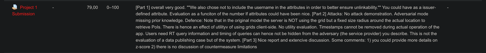

# Secretstroll-BeepBoop
Secretstroll project of CS-523 Advanced Topics on Privacy Enhacing Technologies course at EPFL. Spring 2022.

See https://github.com/Robb-Fr/Secretstroll-BeepBoop-Report for the report repository.

Go in individual parts folders to get details on how to run parts.

## Part 1

In the [/part1](part1) folder, you can find the implementation, test and benchmarks for the anonymous authentication scheme.

## Part 2

In the [/part2](part2) folder, you can find the analysis and measures made to evaluate the privacy of the system.

## Part 3

In the [/part3](part3) folder, you can find the data collection scripts, train data and model of the attack on the tor network traces to breach privacy of users of the system.

## Feedback

